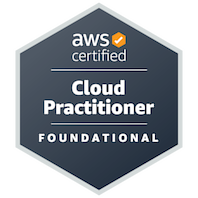

##  Hi there

- 🧑‍💻 I'm a backend engineer.
- 🛠️ Currently building products with TypeScript / Next.js.
- 🎖️ AWS Certified Cloud Practitioner (CLF-C02)
- 📫 How to reach me: [Twitter - @myblackcat7112](https://twitter.com/myblackcat7112)
- 📒 Blog: [Blog](https://myblackcat913.com) 
 

<!--START_SECTION:lapras-card-->

  
Last Updated on 9/23/2026, 11:32:53 AM

<!--END_SECTION:lapras-card-->

<!-- ライトモート：theme=light, ダークモート：theme=dark -->
<!-- アイコンの選択肢一覧：https://arc.net/l/quote/zizyykfh -->
## 🌱 Skills

**Languages** &nbsp;

**Frameworks & Runtime** &nbsp;

**Infrastructure & Data** &nbsp;

 

## 🎖️ Certifications

| Certification | Issued | Valid Through | Verify |
| --- | --- | --- | --- |
| AWS Certified Cloud Practitioner (CLF-C02) | Jan 2025 | Jan 2028 | [Credly](https://www.credly.com/badges/86d1ccc9-b76e-4aaa-8059-1c81adc56b71/public_url) |
 

## 🏃‍♀️ Activities (public repository only!)

 
  
  

  
  

